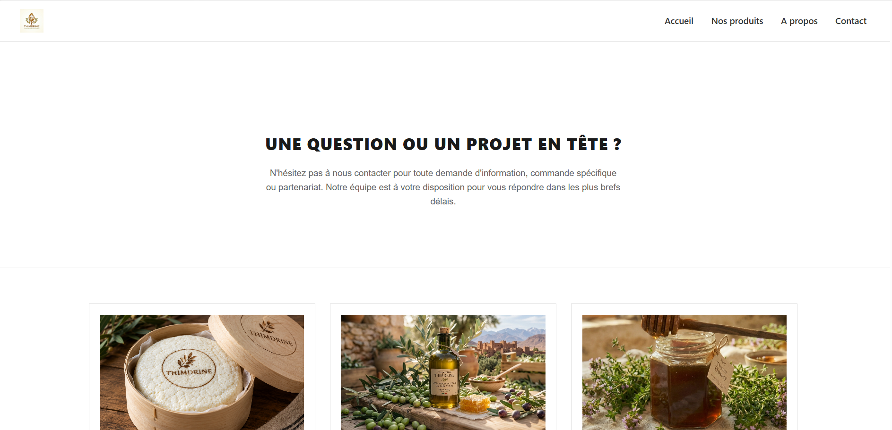
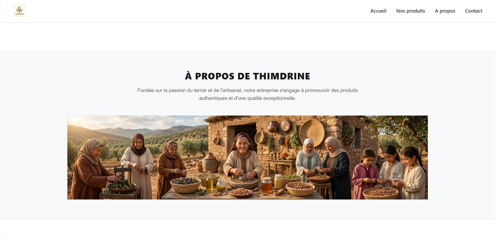
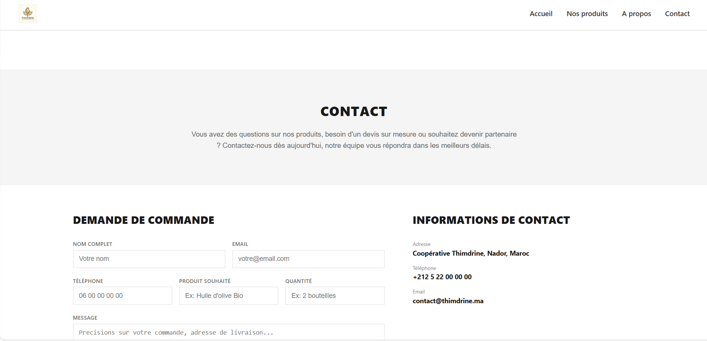

# 🌿 Thimdrine — Site vitrine d’une coopérative du Rif

## 📌 Présentation du projet

**Thimdrine** est un site vitrine réalisé dans le cadre d’un projet de formation en développement web.

La coopérative Thimdrine regroupe 25 femmes de la région de Nador, au Maroc. Elle valorise les produits locaux et le savoir-faire artisanal à travers la production de miel de thym, d’huile d’olive et de confiture de figue de barbarie.

L’objectif de ce projet est de créer un site web moderne, accessible et responsive permettant de présenter la coopérative, de mettre en valeur ses produits et de faciliter les demandes de commande.

## 🎯 Objectifs du projet

* Présenter la coopérative, son histoire et ses valeurs.
* Mettre en avant les produits locaux avec leurs descriptions et leurs prix.
* Faciliter les demandes de commande grâce à un formulaire de contact.
* Offrir une navigation simple et intuitive.
* Adapter l’affichage aux ordinateurs, tablettes et téléphones.
* Respecter les bonnes pratiques HTML5 et CSS3.

## 🖥️ Pages du site

Le site comprend quatre pages principales :

| Page             | Description                                                                       |
| ---------------- | --------------------------------------------------------------------------------- |
| **Accueil**      | Présentation de la coopérative, produits phares et appel à l’action.              |
| **Nos produits** | Présentation des produits sous forme de cartes avec images, descriptions et prix. |
| **À propos**     | Histoire de Thimdrine, valeurs et chiffres clés de la coopérative.                |
| **Contact**      | Formulaire permettant d’envoyer une demande de commande.                          |

Toutes les pages partagent un header et un footer communs afin de garantir une navigation cohérente.

## 🎨 Identité visuelle

La charte graphique s’inspire de la nature, des produits du terroir et de l’artisanat de la région du Rif.

* **Couleurs :** tons naturels, verts, beiges et couleurs chaudes.
* **Typographie :** deux polices maximum pour une lecture agréable.
* **Style :** design simple, chaleureux, naturel et authentique.
* **Mise en page :** cartes produits, espaces aérés et navigation claire.

La charte graphique est définie à l’aide de variables CSS dans `:root`.

## 🛠️ Technologies utilisées

* **HTML5 :** structure sémantique des pages.
* **CSS3 :** styles, mise en page et responsive design.
* **Flexbox :** organisation des éléments et des cartes produits.
* **Media Queries :** adaptation aux différentes tailles d’écran.
* **Figma :** conception du zoning, des wireframes et des maquettes.
* **Git et GitHub :** gestion des versions et hébergement du code.
* **GitHub Pages :** déploiement du site web.

Le projet utilise uniquement HTML5 et CSS3 natifs, sans framework ni JavaScript.

## 📱 Responsive design

Le site est conçu pour offrir une expérience de navigation agréable sur différents appareils :

* Ordinateur de bureau.

Une mise en page flexible et des media queries permettent d’adapter les contenus à la largeur de l’écran.

## 📩 Formulaire de commande

La page Contact contient un formulaire avec les champs suivants :

* Nom complet.
* Adresse e-mail.
* Numéro de téléphone.
* Produit souhaité.
* Quantité.
* Message complémentaire.
* Case de consentement.

La validation des champs repose sur les attributs HTML natifs, notamment `required`, `type`, `pattern` et `min`, sans JavaScript.

## 🖼️ Captures d’écran

### Page d’accueil


### Page Nos produits



### Page À propos



### Page Contact



> **Remarque :** ajoute tes captures d’écran dans un dossier `screenshots` à la racine du projet et utilise les noms de fichiers indiqués ci-dessus. Remplace ces exemples si tes fichiers portent d’autres noms.

## 📁 Structure du projet

```text
thimdrine/
│
├── index.html
├── produits.html
├── apropos.html
├── contact.html
│
├── css/
│   └── style.css
│
├── images/
│   ├── logo.png
│   ├── miel.jpg
│   ├── huile-olive.jpg
│   └── confiture-figue-barbarie.jpg
│
├── screenshots/
│   ├── accueil.png
│   ├── produits.png
│   ├── a-propos.png
│   └── contact.png
│
└── README.md
```

> Adapte cette structure à l’organisation réelle de ton dépôt GitHub.

## 🔗 Liens du projet

* **Site en ligne :** [Voir le site Thimdrine](https://TON-PSEUDO.github.io/TON-REPO/)
* **Dépôt GitHub :** [Voir le code source](https://github.com/TON-PSEUDO/TON-REPO)
* **Maquette Figma :** [Consulter la maquette](LIEN_FIGMA)
* **Board GitHub Projects / Jira :** [Suivre les tâches du projet](LIEN_BOARD)

> Remplace les liens d’exemple par les URL réelles de ton projet.

## ⚙️ Installation et utilisation

Pour consulter le projet en local :

1. Cloner le dépôt GitHub :

   ```bash
   git clone https://github.com/TON-PSEUDO/TON-REPO.git
   ```

2. Accéder au dossier du projet :

   ```bash
   cd TON-REPO
   ```

3. Ouvrir le fichier `index.html` dans un navigateur web.

Aucune installation de dépendances n’est nécessaire.

## ♿ Accessibilité et qualité

Une attention particulière est portée aux bonnes pratiques suivantes :

* Utilisation des balises sémantiques HTML5.
* Présence d’un seul titre principal `h1` par page.
* Ajout d’un attribut `alt` descriptif sur chaque image.
* Respect de la hiérarchie des titres.
* Contraste suffisant entre le texte et l’arrière-plan.
* Formulaire avec champs correctement identifiés et validation native.
* Vérification du HTML avec le validateur W3C.
* Vérification de l’accessibilité avec Lighthouse, avec un objectif de score d’au moins 90 sur la page d’accueil.

## 🌱 Gestion du projet

Le projet est réalisé individuellement sur une période de cinq jours, du 5 au 9 octobre 2026.

Les étapes de réalisation sont :

1. Analyse du besoin et création du backlog de user stories.
2. Réalisation du zoning et des wireframes.
3. Création de la maquette Figma et définition de la charte graphique.
4. Intégration des quatre pages en HTML5 et CSS3.
5. Tests, corrections, revue de code et déploiement sur GitHub Pages.

Les tâches sont suivies sur GitHub Projects ou Jira. Des commits réguliers sont réalisés avec des messages explicites suivant la convention **Conventional Commits**.

Exemples :

```bash
git commit -m "feat: add homepage structure"
git commit -m "feat: create products page"
git commit -m "style: add responsive layout"
git commit -m "fix: improve contact form validation"
git commit -m "docs: update project README"
```

## 🚀 Déploiement

Le site est destiné à être hébergé gratuitement sur **GitHub Pages**.

Pour activer le déploiement :

1. Ouvrir le dépôt GitHub.
2. Accéder à **Settings → Pages**.
3. Sélectionner la branche principale, généralement `main`.
4. Choisir le dossier `/ (root)` si les fichiers HTML sont à la racine.
5. Enregistrer les paramètres et attendre la publication du site.

## 👩‍💻 Réalisation

Projet réalisé dans le cadre d’une formation en développement web.

**Nom du projet :** Thimdrine
**Type :** Site vitrine d’une coopérative locale
**Durée :** 5 jours
**Période :** du 5 au 9 octobre 2026

---

*Thimdrine — Les saveurs du Rif, un savoir-faire à partager.* 🌿

